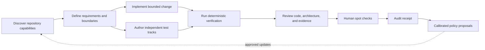

# Clean Code system implementation plan

## Summary

Build a language-neutral and host-neutral plugin that turns Clean Code and Clean Architecture principles into a repeatable agent workflow backed by deterministic checks, independent tests, architectural constraints, human spot checks, and auditable evidence. Deliver the complete skill suite, standalone CLI, host adapters, and shared harness in staged releases without claiming that one metric or one tool can certify software quality.

## Problem frame

Coding agents can follow written instructions for a while, but their conformance degrades as context grows. They can also make the same mistaken assumption in the implementation, tests, and self-review. A prompt that says “write clean code” cannot prove requirement conformance, test sensitivity, dependency direction, or user-visible behavior.

Deterministic tools help, but each result has a narrow meaning. Passing tests establish the tested behavior. Coverage records execution while leaving assertion strength unresolved. Mutation testing probes whether tests notice controlled changes. Complexity and duplication locate review pressure without judging the code by themselves. Architecture checks enforce declared dependency rules; product boundaries still require design judgment.

The system therefore needs four different forms of control:

1. Clear doctrine that guides agent judgment.
2. Independent work tracks that reduce correlated mistakes.
3. Deterministic evidence that cannot be replaced by agent narration.
4. Human spot checks at requirement and user-behavior boundaries.

## Goals

- Work with repositories in any programming language through declared commands and a stable evidence protocol.
- Work across coding platforms, IDE agents, terminal agents, and automated pipelines through one canonical skill source plus tested host adapters.
- Operationalize clean code and architecture principles without copying book text or turning opinions into universal hard rules.
- Separate requirement, implementation, testing, verification, and review responsibilities.
- Make unavailable, skipped, stale, and unverified states explicit.
- Produce an audit receipt that maps requirements to evidence and preserves approved exceptions.
- Support local use, automated pipelines, and future host integrations from the same skill and schema sources.

## Primary users and outcomes

- Repository maintainers who need coding agents to follow existing requirements and quality policy.
- Coding agents that need a stable workflow and machine-verifiable completion conditions.
- Reviewers who need concise evidence, explicit gaps, and permission to accept a change with zero findings.
- Tool and platform authors who need a documented adapter contract instead of a private integration.

The intended outcome is fewer escaped requirement defects, weak tests, and boundary violations without drowning maintainers in unsupported findings. Calibration and controlled benchmarks measure that outcome; installation count or a synthetic cleanliness score does not.

## Non-goals

- Certifying that a codebase is objectively “clean.”
- Requiring a particular architecture, language, framework, test runner, or directory layout.
- Automatically installing or changing repository dependencies.
- Replacing product judgment, security review, performance testing, or human acceptance.
- Reproducing copyrighted book chapters, examples, or code listings.
- Treating line length, function size, coverage, mutation score, complexity, or duplication as a universal merge verdict.

## Requirements

### R1 — Language-neutral operation

Every repository can participate through configured commands, expected exit behavior, optional artifact locations, and declared architecture rules. Parser-aware adapters add precision but are never required for basic operation.

### R2 — Honest evidence states

Every check returns one of `PASS`, `FAIL`, `NOT_AVAILABLE`, `NOT_CONFIGURED`, `NOT_RUN`, or `ERROR`. Results include the command identity, scope, timestamp, duration, exit code, artifact references, and a redacted evidence summary.

### R3 — Rule classification

Each rule declares whether it is:

- deterministic: mechanically testable;
- semantic: requires contextual review;
- convention: owned by the repository;
- architectural: enforceable only after boundaries are declared.

Rules also record applicability, severity defaults, evidence expectations, false-positive notes, source attribution, and superseding rules.

### R4 — Independent test tracks

The workflow separates unit, executable acceptance, integration/contract, and UI/QA work. A repository may mark a track inapplicable with a reason, but absence cannot silently become success.

### R5 — Architecture conformance

Repositories can declare components, permitted dependency directions, forbidden imports, cycle policies, public boundaries, and framework/vendor isolation expectations. Tools enforce the mechanically knowable subset; semantic reviewers assess use-case and responsibility boundaries.

### R6 — Baseline-aware quality signals

Complexity, duplication, coverage, mutation, and architecture debt are compared against a recorded baseline and the changed scope. Regressions can be gated by policy. Existing debt remains visible without forcing an unrelated rewrite.

### R7 — Evidence-based review

Review findings cite files, symbols or behaviors, rule identifiers, evidence, consequence, confidence, and a bounded fix. Reviewers must be allowed to return zero findings. Tool output alone is never pasted as a finding without semantic diagnosis.

### R8 — Human spot checks

The audit records whether a person inspected requirements, acceptance examples, UI/QA procedures, and a code sample. It records scope and outcome without pretending uninspected material was reviewed.

### R9 — Safe repository execution

The harness runs only declared or discovered commands permitted by policy. It supports timeouts, output limits, secret redaction, network restrictions, working-directory isolation, and cancellation. Discovery never installs packages or edits the target repository.

### R10 — Extensible adapters

New languages and tools can be added through a versioned adapter contract without editing the orchestration or skill contracts. Generic command adapters remain the fallback.

### R11 — Traceability

Requirements map to acceptance examples, test tracks, verification results, review decisions, exceptions, and spot-check receipts. Missing links are reported directly.

### R12 — Measurable calibration

Seeded-defect fixtures and controlled comparisons measure detection, false-positive, and correct-silence behavior. Improvement claims require experimental evidence.

### R13 — Host-neutral delivery

Doctrine, workflow contracts, configuration, and evidence semantics have one canonical source. Host adapters may translate installation, invocation, agent delegation, and approval mechanics, but cannot redefine behavior. Environments without native skill support use portable instructions and the standalone CLI.

### R14 — Explicit support tiers

Support claims distinguish the universal baseline, maintained language adapters, maintained host adapters, community adapters, and unavailable capabilities. Universal support covers workflow orchestration, declared commands, normalized evidence, path rules, review, and audit. Parser-level analysis depends on a compatible installed tool or adapter.

### R15 — Policy integrity

A change cannot approve its own weaker policy or introduce a newly trusted command silently. Verification compares proposed configuration with the trusted base revision, runs the change under the base policy by default, and requires separate approval for new commands, disabled gates, broader permissions, adapter trust, or weaker thresholds.

## Skill system

### `clean-setup`

Purpose: connect the system to the current coding platform, IDE, terminal agent, or automated pipeline.

It detects host capabilities, selects a maintained adapter when available, installs or generates only the approved integration files, validates that commands and skills are discoverable, and reports unsupported features. Its generic fallback emits portable Markdown instructions and CLI commands without pretending that the host supports native agents or hooks.

### `clean-discover`

Purpose: establish what the repository can actually run.

Inputs:

- repository root;
- optional configuration;
- execution policy.

Outputs:

- repository inventory;
- discovered and configured commands;
- available adapters;
- capability matrix with honest states;
- proposed configuration changes for human approval.

It leaves tool installation to the user, rejects destructive discovery commands, and reports missing checks accurately.

### `clean-design`

Purpose: turn requested behavior into enforceable design intent.

It identifies actors, use cases, acceptance examples, volatile decisions, policy boundaries, delivery mechanisms, data boundaries, dependency direction, and relevant quality attributes. It produces declarative architecture constraints only where the repository has agreed boundaries.

### `clean-build`

Purpose: implement one bounded behavior at a time.

It requires a failing or absent behavioral check before code where practical, keeps changes scoped, runs the cheapest relevant feedback first, and stops when repeated edits expose a missing concept or misplaced responsibility. It cannot declare completion; it hands evidence to verification.

### `clean-refactor`

Purpose: improve structure while preserving behavior.

It establishes a green safety baseline, identifies one smell or dependency problem, performs small reversible moves, reruns affected checks, and records any intentional behavior change separately. Metrics select investigation targets; developer judgment chooses transformations.

### `clean-test`

Purpose: create independent evidence for behavior.

It coordinates four tracks:

1. Unit tests for local policy and boundary conditions.
2. Executable acceptance examples derived from requirements.
3. Integration and contract tests for component boundaries.
4. UI/QA procedures based on user-visible outcomes.

The authoring context for acceptance and QA work should omit implementation details when feasible. This reduces tests that merely mirror the code.

### `clean-verify`

Purpose: execute configured checks and normalize results.

It runs repository checks, coverage, mutation, duplication, complexity, architecture, packaging, and applicable security or performance commands. It validates artifact freshness, preserves raw logs locally, and produces one normalized evidence bundle.

### `clean-review`

Purpose: interpret the change and its evidence.

It reviews correctness, requirement traceability, design clarity, dependency direction, test quality, maintainability, and operational risk. It distinguishes blocking defects, bounded improvements, advisory observations, and tool noise. Correct silence is part of its calibration set.

### `clean-orchestrate`

Purpose: coordinate independent responsibilities without allowing one agent’s assertion to become evidence.

It assigns explicit ownership, limits shared context where independence matters, sequences hard gates, detects incomplete work, requests spot checks, reconciles contradictory findings, and produces the final handoff. The integrating agent owns the final verification run.

### `clean-audit`

Purpose: produce a durable release receipt.

The receipt includes the change scope, requirement links, check results, mutation summary, architecture result, review decisions, accepted exceptions, spot-check status, stale evidence warnings, and the exact commit or working-tree identity evaluated.

### `clean-learn`

Purpose: improve local policies from confirmed outcomes.

It can propose convention changes, suppressions, thresholds, adapter mappings, and new calibration fixtures. It cannot weaken correctness gates or approve its own proposal. Every learned change is reviewable and reversible.

## End-to-end workflow



## Enforcement model

### Hard gates

Hard gates may block completion when configured and applicable:

- repository build or required static checks fail;
- unit, acceptance, integration, contract, or UI automation fails;
- a declared architecture constraint is violated;
- required evidence is missing, stale, or belongs to another revision;
- a configured mutation threshold regresses;
- a required human spot check is absent;
- the runner returns `ERROR` for a mandatory check.

### Review signals

These trigger inspection unless a repository explicitly promotes them to policy:

- complexity and CRAP-style risk;
- duplication and semantic repetition;
- function, class, module, or component size;
- coverage gaps;
- surviving mutants;
- dependency fan-in/fan-out changes;
- naming, comments, abstraction levels, and responsibility placement.

### Decision order

When rules conflict, use this precedence:

1. Correctness and explicit requirements.
2. Safety, security, privacy, and data integrity.
3. Repository-owned architecture and conventions.
4. Universal maintainability principles.
5. Language idioms.
6. Individual taste.

## Language and tool architecture

The target repository language and the harness implementation language are separate concerns.

## Host, IDE, and CLI architecture

### Canonical source

Every skill, rule, schema, template, and workflow contract lives once in a host-neutral source tree. Generated host packages contain adapters and references to canonical definitions, preventing silent copy drift.

### Maintained host adapters

The first compatibility matrix will cover:

- Codex and `AGENTS.md`-based environments;
- Claude Code and native skill/agent packaging;
- Cursor rules and agent instructions;
- GitHub Copilot repository instructions and custom agents;
- Gemini CLI and other terminal-agent instruction formats;
- Windsurf, Cline, Roo Code, and similar IDE agents through generated rules or portable instructions;
- headless automated pipelines through the standalone CLI.

Any unrecognized host receives the generic integration package. Maintained adapters provide richer native behavior for the listed hosts.

### Generic integration

The generic package includes:

- portable Markdown instructions;
- an `AGENTS.md` block with explicit invocation commands;
- self-contained `clean-code discover`, `verify`, `review`, and `audit` commands for supported operating-system and CPU targets;
- machine-readable JSON results for scripts and automated pipelines;
- documented manual role separation when the host cannot create subagents.

### Capability negotiation

Each host adapter reports support for native skills, subagents, hooks, blocking approvals, file edits, command execution, browser/UI automation, and background tasks. Workflows degrade explicitly. For example, a host without subagents uses separately invoked test and review sessions and records that independence was procedural rather than enforced by the host.

### Distribution boundary

The CLI is implemented in Go and released as checksummed, self-contained executables for supported macOS, Linux, and Windows targets. Target repositories run those executables without a Go installation. Source builds and the portable-instructions path remain available when no released executable matches the environment.

### Generic command adapter

The generic adapter accepts:

- command and working directory;
- applicability conditions;
- timeout and environment policy;
- success exit codes;
- optional parsers for JSON, XML, SARIF, LCOV, and text artifacts;
- severity and gating policy.

Commands are represented as executable-plus-argument arrays. Shell parsing is disabled by default and requires an explicit repository policy because it expands the injection surface.

This path supports any language immediately.

### Maintained adapters

Maintained adapters improve discovery and parsing for ecosystems with stable metadata. Initial fixture coverage should include JavaScript/TypeScript, Python, Java, Go, and Rust. Adapter support is additive; none of these ecosystems defines the core model.

Third-party adapters are declarative and data-only by default. Adapters containing executable provider code require an explicit trust allowlist, provenance, version pin, and checksum or signature verification before loading.

### Architecture adapters

Architecture checks follow three levels:

1. Generic path/module rules for any repository.
2. Import/dependency graph adapters when a parser or build graph exists.
3. Semantic boundary review for responsibilities that syntax cannot prove.

### Tool providers

Providers normalize categories rather than hard-code one vendor:

- repository checks: formatter, linter, type checker, tests, build;
- mutation: PIT, StrykerJS, mutmut, or configured equivalent;
- duplication: PMD CPD, jscpd, or configured equivalent;
- complexity and coverage: repository-selected producers;
- acceptance: Cucumber/Gherkin or another executable-specification runner;
- UI/QA: Playwright or repository-selected browser/mobile automation;
- architecture: repository-selected graph checker or generic rules.

## Shared contracts

### Check result

The normalized result schema contains:

- schema version and check identifier;
- category, provider, adapter, and applicability;
- status and gating disposition;
- repository revision and changed scope;
- start time, duration, exit code, and cancellation state;
- summary, redacted evidence, and local artifact references;
- baseline comparison;
- configuration provenance;
- warnings and parser confidence.

### Requirement trace

Each trace records:

- stable requirement identifier;
- acceptance examples;
- relevant test evidence;
- architecture constraints;
- implementation scope;
- review and exception decisions;
- human spot-check state.

### Audit receipt

Receipts are immutable outputs for a specific repository revision. A new run creates a new receipt. They must never rewrite history to make an old run appear current.

## Planned repository structure

```text
clean-code/
├── .codex-plugin/
│   └── plugin.json
├── cmd/
│   └── clean-code/
│       └── main.go
├── internal/
│   ├── audit/
│   ├── discover/
│   ├── evidence/
│   ├── policy/
│   ├── providers/
│   └── runner/
├── go.mod
├── hosts/
│   ├── generic/
│   ├── codex/
│   ├── claude-code/
│   ├── cursor/
│   ├── copilot/
│   ├── gemini-cli/
│   └── ide-agents/
├── README.md
├── LICENSE
├── docs/
│   ├── architecture.md
│   ├── configuration.md
│   ├── adapter-authoring.md
│   ├── rule-authoring.md
│   └── plans/
├── skills/
│   ├── clean-setup/
│   ├── clean-discover/
│   ├── clean-design/
│   ├── clean-build/
│   ├── clean-refactor/
│   ├── clean-test/
│   ├── clean-verify/
│   ├── clean-review/
│   ├── clean-orchestrate/
│   ├── clean-audit/
│   └── clean-learn/
├── harness/
│   ├── config/
│   ├── doctrine/
│   ├── schemas/
│   ├── adapters/
│   ├── providers/
│   ├── policies/
│   ├── reports/
│   └── calibration/
├── .github/
│   └── workflows/
│       └── release.yml
├── tests/
│   ├── unit/
│   ├── contracts/
│   ├── integration/
│   ├── hosts/
│   ├── fixtures/
│   └── calibration/
└── examples/
    ├── generic/
    ├── javascript/
    ├── python/
    ├── java/
    ├── go/
    └── rust/
```

## Key technical decisions

### K1 — Protocol first, providers second

Skills consume versioned evidence contracts rather than vendor output. This prevents tool selection from leaking into workflow logic and allows repositories to substitute equivalent tools.

### K2 — No aggregate cleanliness score

A single score hides incomparable evidence and encourages gaming. The audit presents gate results, trends, surviving risks, and review decisions separately.

### K3 — Configuration owns applicability

The harness may propose discovered checks, but repository configuration decides which are required. A missing optional tool is visible; a missing required tool fails configuration validation.

### K4 — Baseline the repository, gate the regression

Existing debt stays visible. Default change policy blocks new violations and measurable regressions in changed scope. Repositories can choose stricter cleanup ratchets.

### K5 — Independence is a context boundary

Assigning different agent labels is insufficient. Acceptance and QA authors receive requirements and public contracts, while implementation details are withheld where feasible. Review agents receive the diff and evidence; authorship and approval stay separate.

### K6 — Architecture rules must be declared

Teams declare components and allowed relationships rather than relying on folder names such as `domain` or `core`. Discovery can propose rules for confirmation.

### K7 — Metrics select work; they do not define design

Complexity, coverage, duplication, and mutation results identify investigation targets. A reviewer explains the consequence before a finding becomes actionable.

### K8 — Safe execution by default

Discovery is read-only. Verification uses explicit allowlists, bounded output, timeouts, redaction, and no network by default. Commands that can mutate external state require separate authorization.

### K9 — Original doctrine with traceable attribution

Rule descriptions use original language, include source attribution, expose disagreement or exceptions, and distinguish timeless principles from language-era advice.

### K10 — Generate host packages from one canonical source

Host-specific files are build artifacts produced from canonical skills and contracts. Compatibility tests compare the semantic content of every generated package so packaging differences cannot change the workflow unnoticed.

### K11 — CLI is the universal execution boundary

Native skills improve interaction, but deterministic work routes through the same standalone CLI. This gives IDEs, terminal agents, local developers, and automated pipelines identical statuses, evidence, and exit behavior.

### K12 — Self-contained Go distribution

The CLI uses Go for reproducible cross-compilation and self-contained release artifacts. Plugin skills remain Markdown and schemas remain portable data. The target repository never inherits a Go dependency.

### K13 — Evaluate policy changes against trusted policy

Repository configuration carries executable authority. Pull requests are evaluated with the trusted base policy unless an authorized reviewer approves the policy delta separately. The audit receipt includes both policy identities and the approval result.

## Implementation units

### U0 — Cross-platform packaging and setup contract

**Goal:** make platform support an explicit, testable layer before feature skills depend on host behavior.

**Depends on:** none.

**Create:**

- `skills/clean-setup/SKILL.md`
- `hosts/host-capabilities.schema.json`
- `hosts/generic/`
- maintained host adapter manifests;
- `internal/hosts/`
- `tests/hosts/capability_matrix_test.go`
- `tests/hosts/generated_packages_test.go`

**Approach:** define the canonical skill format, host capability vocabulary, generic fallback, generation rules, and semantic parity tests. Native packaging is optional; shared behavior is mandatory.

**Test scenarios:** recognized host; unknown host; native skills without subagents; IDE with rules but no hooks; CLI-only environment; incompatible host version; generated package drift; missing approval primitive; Windows and Unix installation paths.

**Verification:** every maintained adapter installs into an isolated fixture, exposes the expected skills or fallback instructions, and produces the same normalized verification result for a shared sample repository.

### U1 — Contracts and doctrine foundation

**Goal:** establish the stable vocabulary all skills and tools share.

**Depends on:** none; may proceed alongside U0.

**Create:**

- `harness/schemas/check-result.schema.json`
- `harness/schemas/requirement-trace.schema.json`
- `harness/schemas/audit-receipt.schema.json`
- `harness/schemas/adapter.schema.json`
- `harness/doctrine/clean-code.yaml`
- `harness/doctrine/clean-architecture.yaml`
- `harness/doctrine/language-conventions.schema.yaml`
- `internal/contracts/schema_test.go`
- `internal/doctrine/doctrine_test.go`

**Approach:** define versioned schemas first. Seed doctrine with representative rules across names, functions, duplication, boundaries, tests, dependency direction, component cycles, framework isolation, and use-case separation. Each rule includes classification and evidence requirements.

**Test scenarios:** valid fixtures; missing required fields; unknown statuses; contradictory applicability; duplicate rule IDs; invalid source attribution; semantic rule incorrectly marked deterministic; schema-version mismatch.

**Verification:** the compiled CLI validates every fixture using its embedded schema validator; doctrine IDs are unique and cross-references resolve.

### U2 — Configuration and capability discovery

**Goal:** discover repository facts without modifying the target.

**Depends on:** U0 and U1.

**Create:**

- `harness/config/defaults.yaml`
- `harness/config/config.schema.json`
- `harness/adapters/generic-command.yaml`
- `internal/discover/`
- `cmd/clean-code/main.go`
- `skills/clean-discover/SKILL.md`
- `internal/discover/discover_test.go`
- `tests/integration/discover_test.go`

**Approach:** inspect known project metadata, repository configuration, and explicitly declared commands. Emit proposed capabilities and honest states. Never execute package installers during discovery.

**Test scenarios:** unknown language; polyglot monorepo; missing executable; malformed configuration; configured command overrides discovery; unsafe command rejected; no tools available; paths containing spaces; Windows path fixture.

**Verification:** discovery is idempotent and leaves fixture hashes unchanged.

### U3 — Verification runner and provider protocol

**Goal:** execute checks safely and emit normalized evidence.

**Depends on:** U1 and U2.

**Create:**

- `internal/runner/`
- `internal/evidence/`
- `internal/providers/repository_command.go`
- `internal/providers/artifact_parser.go`
- `harness/policies/default-policy.yaml`
- `skills/clean-verify/SKILL.md`
- `internal/runner/runner_test.go`
- `internal/providers/contract_test.go`
- `tests/integration/verification_pipeline_test.go`

**Approach:** implement command allowlisting, timeouts, cancellation, bounded capture, environment filtering, secret redaction, artifact freshness, baseline comparison, and normalized status handling.

**Test scenarios:** pass/fail/error distinction; timeout; cancellation; stale artifact; secret in output; missing required provider; optional unavailable provider; nonzero success code configuration; malformed tool output; changed-scope baseline regression; pull request adds a command; pull request disables a gate; approved policy delta; base policy unavailable.

**Verification:** integration fixtures produce deterministic evidence bundles and never expose seeded secrets.

### U4 — Language and analysis adapters

**Goal:** add rich automation without coupling the core to a language.

**Depends on:** U1 and U3.

**Create:**

- `harness/adapters/javascript.yaml`
- `harness/adapters/python.yaml`
- `harness/adapters/java.yaml`
- `harness/adapters/go.yaml`
- `harness/adapters/rust.yaml`
- `harness/providers/mutation/`
- `harness/providers/duplication/`
- `harness/providers/coverage/`
- `harness/providers/complexity/`
- `internal/adapters/contract_test.go`
- `tests/fixtures/languages/`

**Approach:** keep adapters declarative when possible. Provider parsers translate tool artifacts into the shared result contract. Add a documented adapter SDK so unsupported ecosystems can declare commands immediately and gain richer parsing later.

**Test scenarios:** each maintained ecosystem; mixed-language repository; tool version variation; absent optional fields; partial results; generic adapter equivalence; third-party adapter schema compatibility.

**Verification:** removing every maintained adapter still leaves the generic fixture operational.

### U5 — Design and architecture enforcement

**Goal:** connect product requirements to dependency rules and reviewable boundaries.

**Depends on:** U1 and U3.

**Create:**

- `skills/clean-design/SKILL.md`
- `harness/schemas/architecture-policy.schema.json`
- `internal/providers/architecture/path_rules.go`
- `internal/providers/architecture/graph_contract.go`
- `docs/architecture.md`
- `internal/providers/architecture/rules_test.go`
- `tests/integration/architecture_test.go`

**Approach:** support declared components, allowed dependency directions, cycles, public surfaces, and forbidden framework/vendor reach. Pair mechanical checks with semantic prompts for use-case and responsibility analysis.

**Test scenarios:** allowed inward dependency; forbidden outward dependency; indirect cycle; test-only exception; generated-code exclusion; polyglot boundary; undeclared component; framework type crossing an inner boundary.

**Verification:** seeded architecture violations fail with the exact dependency path; compliant fixtures pass without findings.

### U6 — Build and refactor workflows

**Goal:** guide implementation and cleanup through short verified loops.

**Depends on:** U1 and U2.

**Create:**

- `skills/clean-build/SKILL.md`
- `skills/clean-refactor/SKILL.md`
- `harness/schemas/work-handoff.schema.json`
- `internal/contracts/work_handoff_test.go`
- `tests/calibration/build-workflow/`
- `tests/calibration/refactor-workflow/`

**Approach:** encode the stop rule, responsibility checks, dependency direction, behavior-preserving refactoring sequence, smallest relevant verification, and explicit handoff to independent verification.

**Test scenarios:** feature expansion reveals missing abstraction; refactor starts from red baseline; behavior change disguised as cleanup; unrelated edits; architecture violation introduced by convenience dependency; successful small-step handoff.

**Verification:** calibrated transcripts reject false completion and preserve correct no-change outcomes.

### U7 — Independent testing workflow

**Goal:** prevent implementation-shaped tests from becoming the only oracle.

**Depends on:** U1 and U2.

**Create:**

- `skills/clean-test/SKILL.md`
- `harness/schemas/test-plan.schema.json`
- `harness/schemas/qa-procedure.schema.json`
- `harness/templates/acceptance.feature`
- `harness/templates/qa-procedure.md`
- `internal/contracts/traceability_test.go`
- `tests/calibration/test-independence/`

**Approach:** derive tests from requirements and public contracts. Record test-track ownership, inputs received, evidence, and applicability. Gherkin is optional; executable examples are required.

**Test scenarios:** requirement without acceptance example; test mirrors implementation detail; boundary case omitted; UI procedure asserts internals; inapplicable track with reason; same mistaken assumption across all tracks; hidden oracle catches the correlation.

**Verification:** traceability reports missing and circular evidence, while complete independent fixtures pass.

### U8 — Review, orchestration, and human gates

**Goal:** combine independent judgments without converting narration into proof.

**Depends on:** U3, U5, U6, and U7.

**Create:**

- `skills/clean-review/SKILL.md`
- `skills/clean-orchestrate/SKILL.md`
- `harness/schemas/review-finding.schema.json`
- `harness/schemas/spot-check.schema.json`
- `harness/calibration/reviewer/`
- `internal/review/synthesis_test.go`
- `tests/calibration/orchestration/`

**Approach:** define roles, context boundaries, evidence requirements, conflict resolution, correct silence, reviewer self-conflict rules, and explicit human checkpoints. The final integrator reruns mandatory checks against the final revision.

**Test scenarios:** unsupported finding; duplicate findings; conflicting reviewers; tool noise; correct zero-finding change; author approving own work; stale verification after merge; missing human receipt; partial spot-check represented honestly.

**Verification:** calibration catches seeded defects, suppresses unsupported claims, and preserves a no-finding result for clean fixtures.

### U9 — Audit and learning loop

**Goal:** produce durable proof and improve local policy safely.

**Depends on:** U3 and U8.

**Create:**

- `skills/clean-audit/SKILL.md`
- `skills/clean-learn/SKILL.md`
- `internal/audit/`
- `harness/reports/audit-template.md`
- `harness/policies/change-proposal.schema.json`
- `internal/audit/audit_test.go`
- `internal/policy/learning_test.go`

**Approach:** bind receipts to repository identity and evidence hashes. Learning emits proposals rather than direct policy mutation. Approved changes retain provenance and rollback information.

**Test scenarios:** receipt for wrong revision; missing raw artifact; expired evidence; approved exception; proposed suppression of hard gate; reversible threshold update; repeated false positive; tampered receipt.

**Verification:** receipts are reproducible from the same evidence bundle and tampering is detected.

### U10 — Packaging, documentation, and release gates

**Goal:** make the system installable, understandable, and testable as one plugin.

**Depends on:** U0 through U9.

**Create:**

- all skill documentation and reference assets;
- standalone CLI package and command reference;
- generated host packages and compatibility matrix;
- `docs/configuration.md`
- `docs/adapter-authoring.md`
- `docs/rule-authoring.md`
- `LICENSE`
- `CHANGELOG.md`
- `tests/plugin_manifest_test.go`
- `tests/skill_links_test.go`
- `tests/examples_test.go`
- `tests/hosts/installation_test.go`

**Approach:** keep one canonical skill source, generate host packages, validate every link and referenced asset, document CLI/native/manual setup, provide generic and maintained-adapter examples, and define semantic versioning for schemas, CLI output, and adapter compatibility.

**Test scenarios:** invalid manifest; missing skill asset; broken relative link; stale example; unsupported schema version; clean CLI installation; native host installation; generic fallback; generated-package drift; upgrade with backward-compatible config; upgrade requiring migration.

**Verification:** plugin validation, skill validation, contract tests, fixture suite, and documentation examples all pass from a clean checkout.

### U11 — Outcome benchmark and release qualification

**Goal:** test whether the system improves agent-produced changes.

**Depends on:** U3 through U10.

**Create:**

- `harness/calibration/benchmark-manifest.yaml`
- `harness/calibration/seeded-defects/`
- `harness/calibration/clean-controls/`
- `internal/benchmark/`
- `docs/benchmark-method.md`
- `internal/benchmark/scoring_test.go`

**Approach:** run controlled tasks with and without the harness, use hidden behavioral and architectural oracles, separate defect detection from false positives, and report raw outcomes with confidence limits. The held-out evaluation set remains untouched during rule tuning.

**Test scenarios:** seeded requirement defect; weak assertion detected by mutation; architecture leak; duplicate business rule; misleading metric; harmless unconventional code; correct silence; unavailable tool; correlated implementation/test mistake.

**Verification:** benchmark runs are reproducible from pinned fixtures and produce no marketing claim without an attached result set.

## Release sequence

### Release 0 — Foundation

Contracts, doctrine samples, plugin manifest, CLI shell, host capability model, generic fallback, configuration model, and validation tests.

### Release 1 — Useful vertical slice

Setup, discovery, generic command verification, design/build/test/review skills, architecture path rules, audit receipt, CLI commands, and generic examples. This release must work for an unknown language repository on an unknown coding host.

### Release 2 — Rich adapters

Maintained ecosystem adapters, mutation/duplication/coverage parsers, graph-based architecture providers, baseline policies, and expanded fixtures.

### Release 3 — Full orchestration

Independent agent contexts, human spot-check workflow, calibrated reviewer, learning proposals, and complete release qualification.

### Release 4 — Extended system

Automated pipeline templates, organizational policy packs, language and host adapter SDK stabilization, historical trend reports, incremental large-repository execution, additional native integrations, and public benchmark reporting.

## Validation strategy

### Contract validation

- Every schema has valid and invalid fixtures.
- Every adapter passes the same compatibility suite.
- Older supported schema versions remain readable or produce a documented migration error.
- Every generated host package remains semantically equivalent to the canonical skills.

### Behavioral validation

- Generic operation succeeds without a maintained language adapter.
- Required unavailable checks block; optional unavailable checks remain visible.
- Changed-scope regressions are distinguished from inherited debt.
- Evidence is tied to the exact repository revision.
- The same fixture produces equivalent results through native-host and standalone-CLI entry points.

### Calibration validation

- Seeded defects are detected with cited evidence.
- Clean controls permit zero findings.
- Tool warnings become defects only after a reviewer establishes their semantic consequence.
- Independence fixtures withhold implementation context from separate agents.

### Security validation

- Commands outside policy are rejected.
- Timeouts and cancellation terminate child processes.
- Secrets are removed from normalized output and reports.
- Discovery leaves fixtures unchanged and keeps network access disabled.
- Artifact paths cannot escape the repository or configured evidence directory.

## System-wide impact

### Configuration

Repositories gain one optional policy file. Defaults permit discovery and reporting with zero invented hard gates. Promotion to a blocking gate is explicit and version controlled. Changes to trusted commands, permissions, adapter identities, gate status, or thresholds require separate policy approval.

### Data and artifacts

Evidence bundles and audit receipts are local by default, content-addressed, and safe to delete without changing source code. Output is redacted before persistence. Unredacted raw-log storage is disabled by default and, when explicitly enabled, uses a private directory, restrictive permissions, a bounded retention period, and a visible warning in the audit receipt.

### Error handling

Provider failures, missing tools, configuration errors, test failures, and policy violations remain distinct. The orchestrator cannot turn `ERROR` or `NOT_RUN` into `PASS`.

### Supply-chain boundary

Release executables publish checksums and provenance. Host packages verify CLI compatibility. Community adapters cannot execute code unless the repository explicitly trusts their identity and pinned version.

### Performance

Checks are grouped into fast, affected, and full tiers. Mutation and full UI suites run only when configured or at release gates. Caching keys include tool version, configuration, repository revision, and relevant input paths.

### Observability

Local reports show duration, failure category, adapter/provider version, cache use, baseline movement, and evidence freshness. Telemetry is opt-in and contains no source code by default.

## Risks and mitigations

| Risk | Consequence | Mitigation |
| --- | --- | --- |
| Metric gaming | Agents optimize numbers instead of design. | Keep metrics separate, require semantic consequence, use hidden calibration fixtures. |
| Correlated mistakes | Implementation and tests agree on the wrong behavior. | Independent contexts, requirement-derived acceptance tests, hidden oracles, human spot checks. |
| False-positive fatigue | Teams disable the system. | Baseline changes, confidence, correct-silence fixtures, local suppressions with provenance. |
| Toolchain cost | Mutation or UI suites make feedback unusably slow. | Fast/affected/full tiers, caching, explicit release gates. |
| Cross-language drift | Adapters behave inconsistently. | Versioned contracts and one shared compatibility suite. |
| Cross-host drift | IDE and CLI integrations enforce different workflows. | Generate adapters from canonical sources and run semantic parity fixtures. |
| Host capability gaps | A platform cannot spawn agents or run hooks. | Capability negotiation, explicit degradation, separate-session fallback, standalone CLI. |
| Adapter supply-chain compromise | A third-party adapter executes malicious commands. | Data-only default, trust allowlist, pinned versions, checksums/signatures, no implicit downloads. |
| Policy self-bypass | A change disables the checks evaluating that same change. | Compare against trusted base policy, separate policy-delta approval, record both policy identities. |
| Architecture theater | Folder rules create the appearance of good boundaries. | Require declared intent and pair graph checks with semantic design review. |
| Unsafe command execution | Discovery or verification mutates external state. | Read-only discovery, allowlists, network-off default, timeouts, explicit authorization. |
| Copyright misuse | Rules reproduce protected text. | Original summaries, citations, no book code listings, legal review before publication. |
| Scope overload | The plugin becomes difficult to adopt. | Useful vertical slice first, progressive configuration, optional advanced providers. |

## Definition of done

The complete system is done when:

- all eleven skills validate and can be invoked independently;
- an unknown-language fixture on an unknown host completes setup, discovery, generic verification, review, and audit through the fallback path;
- maintained host adapters pass installation, capability, and semantic-parity tests;
- released CLI executables pass smoke tests on supported macOS, Linux, and Windows targets without a language runtime installed;
- maintained adapters pass the shared compatibility suite;
- architecture violations and weak tests are caught in seeded fixtures;
- clean controls produce zero unsupported findings;
- required human checks cannot be represented as complete when absent;
- final evidence is bound to the tested repository revision;
- a clean checkout passes plugin, schema, contract, integration, calibration, security, and documentation tests;
- the benchmark reports measured outcomes without unsupported quality claims.

## Sources and research

- Robert C. Martin, *Clean Code* and *Clean Architecture*, summarized from the user-provided copies.
- Martin's public replies supplied in the project brief concerning deterministic tools, unit/acceptance/UI testing, mutation analysis, human spot checks, and multi-agent orchestration.
- [Huolter clean-code-skill](https://github.com/huolter/clean-code-skill) — machine-readable doctrine, deterministic runner, reviewer calibration, and honest check states.
- [Cucumber Gherkin reference](https://cucumber.io/docs/gherkin/) — executable specification vocabulary.
- [PIT mutation testing](https://pitest.org/) — JVM mutation testing.
- [StrykerJS](https://stryker-mutator.io/docs/stryker-js/introduction/) — JavaScript and TypeScript mutation testing.
- [mutmut](https://mutmut.readthedocs.io/) — Python mutation testing.
- [PMD Copy/Paste Detector](https://pmd.github.io/pmd/pmd_userdocs_cpd.html) and [jscpd](https://github.com/kucherenko/jscpd) — duplication detection approaches.
- [Playwright testing guidance](https://playwright.dev/docs/best-practices) — user-visible behavior and isolated UI tests.
