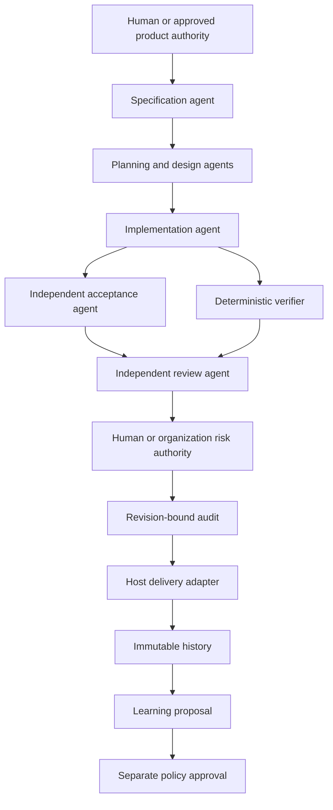
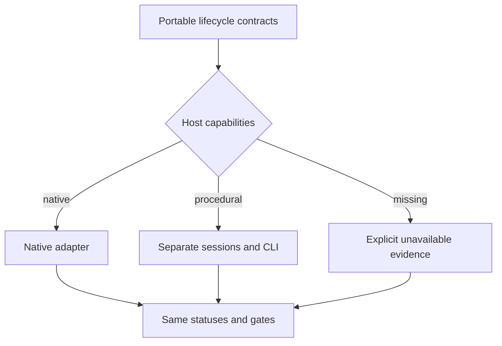

# Agent-First Clean Code Standard - Plan

## Goal Capsule

- **Objective:** Make Clean Code the portable operating standard for agents that specify, build, test, review, deliver, and learn from software work.
- **Authority:** Product requirements and approved policy outrank plans; plans outrank implementation preferences; revision-bound evidence outranks agent narration.
- **Execution profile:** Independent agent roles with deterministic checks at every boundary.
- **Stop conditions:** Stop on missing required evidence, self-approval, stale revision identity, unapproved policy weakening, or unresolved blocking findings.
- **Tail ownership:** The integrating agent owns final verification and delivery. A separate reviewing agent owns approval. A human or pre-approved organization policy owns risk and exception acceptance.

---

## Product Contract

### Summary

Clean Code becomes an agent-first engineering system. It borrows the useful lifecycle coverage from Compound Engineering and rewrites each responsibility around Clean Code, Clean Architecture, independent evidence, and stable dependency boundaries. The core does not assume a model, coding host, source-control provider, IDE, shell, browser, or subagent implementation.

### Problem Frame

The current plugin covers design through audit but leaves gaps around product framing, debugging, delivery, feedback, continuity, policy distribution, historical evidence, incremental checks, and real agent evaluation. Its audit also assumes a human reads code. That assumption does not match an agent-first workflow where independent agents inspect code and people approve requirements, policy, exceptions, and release risk from concise evidence.

### Requirements

#### Agent operating model

- R1. The system covers the complete agent lifecycle through focused responsibilities for product definition, implementation, evidence, delivery, feedback, and continuity.
- R2. Specification, implementation, acceptance, verification, and approval roles carry explicit identities and cannot approve work they authored.
- R3. Every agent handoff is bounded by requirements, allowed files or surfaces, revision identity, evidence expectations, and stop conditions.
- R4. Host adapters translate capabilities while doctrine, status meanings, contracts, and gates remain identical across models, tools, and environments.
- R5. Missing host capabilities degrade honestly to procedural or unavailable states without changing the definition of success.

#### Review and human control

- R6. Independent agent review replaces mandatory human code reading and returns evidence-backed findings or correct silence.
- R7. Humans or pre-approved organization policy approve product intent, policy changes, exceptions, and release risk; code inspection remains optional and recordable.
- R8. No agent may author and approve the same change, test oracle, policy weakening, or audit receipt.
- R9. A release audit remains incomplete when required independent review, deterministic verification, or decision authority is missing.

#### Product capabilities

- R10. Maintained read-only language adapters cover Go, Java, JavaScript/TypeScript, Python, Rust, Ruby, Swift, and .NET without granting execution authority.
- R11. Native host integrations expose the same verification contract through host-owned mechanisms, beginning with a composite GitHub Action.
- R12. Organization policy packs layer over repository policy with explicit precedence, provenance, command trust, exceptions, and drift detection.
- R13. Historical reporting consumes immutable receipts and reports per-signal trends without collapsing evidence into a universal cleanliness score.
- R14. Incremental verification identifies changed scope conservatively, runs only policy-authorized checks, and falls back to full verification when impact is unknown.
- R15. Release qualification always runs full required verification even when incremental checks passed earlier.

#### Evaluation and learning

- R16. A controlled held-out agent study compares the same tasks with and without the workflow under pinned models, tools, repositories, limits, and scoring oracles.
- R17. Study results publish raw case outcomes, false positives, failures, correct silence, metadata, and limitations before any performance claim.
- R18. Skill changes are evaluated against a versioned corpus and may not weaken correctness, safety, privacy, data integrity, or explicit requirements to improve a score.
- R19. Confirmed outcomes can propose reversible policy, adapter, threshold, or skill changes but cannot approve or activate their own proposals.

#### Delivery

- R20. The repository establishes `main`, merges only a final verified revision, tags `v0.1.0`, and confirms checksummed release artifacts for supported platforms.
- R21. Delivery adapters can commit, open changes, watch automation, and handle feedback, but the portable core describes outcomes rather than provider commands.
- R22. A deterministic sloppiness assessor reports evidence, consequence, bounded repair instructions, and verification without editing code or authorizing its own result.
- R23. Automated remediation is limited to one repair batch and one verification pass; remaining or conflicting findings escalate with both reports and the tested diff.

### Acceptance Examples

- AE1. Given an implementation agent authored a change, when the same identity submits approval, then audit reports self-approval and remains incomplete.
- AE2. Given an independent review with zero findings and passing revision-bound verification, when authorized release risk is accepted, then audit can complete without a human reading code.
- AE3. Given an organization pack requires a command that repository policy omits, when policies are resolved, then the command remains required and the delta is visible.
- AE4. Given repository policy weakens an organization gate, when verification runs without an approved exception, then verification blocks before command execution.
- AE5. Given historical receipts contain coverage and mutation data, when a trend is generated, then each metric retains its own scale, scope, and provenance.
- AE6. Given changed-file impact cannot be mapped safely, when incremental verification is requested, then the system records the fallback and runs the full trusted command set.
- AE7. Given a held-out study has insufficient or unbalanced cases, when results are produced, then raw outcomes are available but improvement claims remain blocked.
- AE8. Given a host has no native subagents, when orchestration runs, then separate sessions or procedural independence are recorded and self-approval remains forbidden.
- AE9. Given findings remain after the second sloppiness assessment, when an agent requests another rewrite, then the system returns `ESCALATE` and explicitly stops automated rewriting.

### Scope Boundaries

- The core does not require GitHub, Git, a browser, Xcode, a terminal, or any named model.
- The core does not certify that code is objectively clean.
- The system does not replace product, security, privacy, or release-risk authority.
- Provider-specific automation belongs in host adapters.
- A small internal study cannot support universal performance claims.

---

## Planning Contract

### Key Technical Decisions

- KTD1. **Use stable lifecycle responsibilities instead of copying every Compound skill.** (session-settled: user-directed — chosen over retaining only the original eleven skills: the product must become the golden agent-building standard.) Compound concepts are merged when they share one Clean Architecture responsibility.
- KTD2. **Make role identity and independence first-class evidence.** Review and audit compare actor identities, source revisions, and evidence provenance before accepting approval.
- KTD3. **Separate portable skills from host adapters.** Skills state inputs, outcomes, evidence, and stop conditions. Adapters own GitHub, browser, Xcode, IDE, and terminal mechanics.
- KTD4. **Layer policy without silent weakening.** Organization requirements form the floor; repository policy may add stricter checks; exceptions require separate authority and remain visible.
- KTD5. **Store history as immutable receipt references.** Reports aggregate validated receipts and retain each metric independently.
- KTD6. **Treat incremental verification as a feedback optimization.** Unknown impact and releases force the full trusted policy.
- KTD7. **Treat experiments as evidence, not marketing.** Study manifests pre-register tasks and oracles; results preserve failures and limitations.
- KTD8. **Keep humans at decision boundaries.** A human may inspect code, but release completeness depends on authorized decisions and independent agent evidence rather than mandatory manual code reading.
- KTD9. **Score observable evidence, not aesthetic taste.** Sloppiness is a transparent triage signal with per-finding instructions; it is neither a cleanliness certificate nor a merge verdict.

### High-Level Technical Design





### Output Structure

```text
skills/
  clean-<responsibility>/SKILL.md
internal/
  policyset/
  history/
  incremental/
  study/
harness/
  schemas/
  policies/
  studies/
hosts/
  github/
docs/
  agent-operating-model.md
  policy-packs.md
  history.md
  incremental-verification.md
  study-method.md
```

### Risks and Mitigations

- Skill proliferation can create overlapping authority. Each skill gets one outcome, one evidence contract, and explicit routing boundaries.
- Agent review can repeat implementation mistakes. Acceptance and review contexts receive requirements and public contracts while withholding implementation detail when feasible.
- Policy layering can grant unexpected execution authority. Resolution occurs before execution and reports every new command or weaker gate.
- Incremental checks can miss impact. Unknown graphs and release mode force full verification.
- Small studies can overstate results. Claims remain blocked until the manifest and result set meet pre-registered adequacy rules.

---

## Implementation Units

### U1. Record the agent-first product contract

- **Goal:** Add this implementation-ready plan and align public product language.
- **Requirements:** R1-R21
- **Dependencies:** None
- **Files:** `docs/plans/2026-08-12-002-feat-agent-first-clean-code-plan.md`, `README.md`, `docs/architecture.md`
- **Approach:** Keep requirements stable and route provider-specific behavior to adapters.
- **Test scenarios:** Repository link and metadata tests accept the new plan.
- **Verification:** The plan is discoverable and every later unit cites its governing requirements.

### U2. Make agent roles and approval independent

- **Goal:** Replace mandatory human code reading with independent agent review plus authorized risk decisions.
- **Requirements:** R2, R3, R6-R9
- **Dependencies:** U1
- **Files:** `internal/review/review.go`, `internal/review/review_test.go`, `internal/audit/audit.go`, `internal/audit/audit_test.go`, `harness/schemas/review-input.schema.json`, `harness/schemas/spot-check.schema.json`, `skills/clean-review/SKILL.md`, `skills/clean-audit/SKILL.md`, `skills/clean-orchestrate/SKILL.md`
- **Execution note:** Start from failing self-approval and no-human-code-reading acceptance cases.
- **Test scenarios:**
  - Covers AE1. Matching author and approver identities block.
  - Covers AE2. Independent zero-finding approval plus authorized risk decision completes.
  - Missing reviewer identity or revision blocks.
  - Optional human code inspection is preserved without becoming mandatory.
- **Verification:** Unit and audit integration tests prove independence and decision authority.

### U3. Expand the portable skill suite

- **Goal:** Cover the full agent lifecycle with focused Clean Code responsibilities.
- **Requirements:** R1-R5, R18, R19, R21
- **Dependencies:** U1, U2
- **Files:** `skills/clean-*/SKILL.md`, `.codex-plugin/plugin.json`, `tests/repository_test.go`, `docs/agent-operating-model.md`
- **Approach:** Add strategy, ideation, specification, planning, debugging, simplification, optimization, integration, release, watching, feedback, handoff, explanation, policy, and study responsibilities; preserve the existing design/build/test/evidence skills.
- **Test scenarios:**
  - Every declared skill has valid metadata, a bounded outcome, evidence, and stop conditions.
  - No portable skill requires a named host, model, or provider.
  - Routing boundaries have no duplicate approval owner.
- **Verification:** Repository tests validate the catalog and a contract linter validates skill invariants.

### U4. Add organization policy packs

- **Goal:** Resolve organization and repository policy with explicit provenance and drift.
- **Requirements:** R12, R19
- **Dependencies:** U2
- **Files:** `internal/policyset/policyset.go`, `internal/policyset/policyset_test.go`, `harness/schemas/policy-pack.schema.json`, `harness/policies/example-organization-policy.json`, `cmd/clean-code/main.go`, `docs/policy-packs.md`
- **Execution note:** Begin with weakening, duplicate command, exception, and precedence failures.
- **Test scenarios:**
  - Covers AE3. Organization-required commands remain required.
  - Covers AE4. Repository weakening blocks without a separately approved exception.
  - Stricter repository additions retain both provenance layers.
  - Conflicting command identities fail closed.
- **Verification:** `clean-code policy` produces a deterministic resolved policy and deltas.

### U5. Add immutable historical reporting

- **Goal:** Report per-signal trends from validated receipts.
- **Requirements:** R13
- **Dependencies:** U2
- **Files:** `internal/history/history.go`, `internal/history/history_test.go`, `harness/schemas/history-report.schema.json`, `cmd/clean-code/main.go`, `docs/history.md`
- **Test scenarios:**
  - Covers AE5. Metrics keep independent scales and provenance.
  - Duplicate or tampered receipts fail.
  - Mixed revisions sort deterministically.
  - Missing metrics remain absent rather than zero.
- **Verification:** `clean-code history` emits a deterministic report from receipt paths.

### U6. Add conservative incremental verification

- **Goal:** Select safe check scope for large repositories without weakening release gates.
- **Requirements:** R14, R15
- **Dependencies:** U4
- **Files:** `internal/incremental/incremental.go`, `internal/incremental/incremental_test.go`, `harness/schemas/impact-map.schema.json`, `cmd/clean-code/main.go`, `docs/incremental-verification.md`
- **Test scenarios:**
  - Known changed paths select mapped checks.
  - Covers AE6. Unknown impact records fallback and selects full policy.
  - Release mode always selects full policy.
  - Escaping, absolute, or ambiguous paths fail closed.
- **Verification:** Selection tests and CLI integration preserve the trusted command set.

### U7. Add a controlled agent study

- **Goal:** Run and report a held-out comparison without unsupported claims.
- **Requirements:** R16-R18
- **Dependencies:** U2, U3
- **Files:** `internal/study/study.go`, `internal/study/study_test.go`, `harness/schemas/study-manifest.schema.json`, `harness/schemas/study-result.schema.json`, `harness/studies/held-out-v1.json`, `cmd/clean-code/main.go`, `docs/study-method.md`
- **Test scenarios:**
  - Paired tasks require matching model, tools, limits, and oracle.
  - Covers AE7. Insufficient or unbalanced results block claims.
  - Failures and timeouts remain in raw results.
  - Summary metrics match raw cases exactly.
- **Verification:** `clean-code study` validates pre-registration and scores completed result sets.

### U8. Qualify and release the final revision

- **Goal:** Merge the complete agent-first standard and publish `v0.1.0`.
- **Requirements:** R10, R11, R20
- **Dependencies:** U2-U7
- **Files:** `README.md`, `CHANGELOG.md`, `.github/workflows/ci.yml`, `.github/workflows/release.yml`
- **Test scenarios:**
  - Eight language fixtures return read-only proposals.
  - The native GitHub Action runs trusted verification end to end.
  - Full race tests, vet, schema checks, cross-builds, review, and audit bind to one revision.
  - Release artifacts and checksums exist for every declared platform.
- **Verification:** Final CI passes on `main`; the release workflow succeeds for `v0.1.0`.

### U9. Add bounded sloppiness assessment

- **Goal:** Give agents a deterministic repair brief without creating a rewrite loop.
- **Requirements:** R22, R23
- **Dependencies:** U1
- **Files:** `internal/sloppiness/sloppiness.go`, `internal/sloppiness/sloppiness_test.go`, `harness/schemas/sloppiness-report.schema.json`, `cmd/clean-code/main.go`, `docs/sloppiness.md`
- **Test scenarios:**
  - Every finding includes location, observed evidence, consequence, one instruction, and verification.
  - Generated and dependency code do not affect the report.
  - Clean evidence returns `DONE`; first-pass findings return `REPAIR`.
  - Covers AE9. Any second-pass finding returns `ESCALATE` with an explicit stop instruction.
- **Verification:** Unit and CLI tests prove deterministic scoring and the two-pass ceiling.

---

## Verification Contract

| Gate | Scope | Required result |
| --- | --- | --- |
| Unit and integration | All Go packages | `PASS` under race detection |
| Static analysis | All Go packages | `PASS` |
| Schema and skill contracts | Harness and skill corpus | `PASS` |
| Cross-build | Linux, macOS, Windows targets | `PASS` |
| Native action smoke | Composite GitHub Action | `PASS` |
| Independent review | Final revision | No unresolved `BLOCKING` findings |
| Agent study | Pre-registered held-out corpus | Raw results valid; claim gate reported honestly |
| Audit | Final revision and evidence set | Complete or explicit gaps that block release |
| Release | `v0.1.0` tag | All binaries and checksums published |

---

## Definition of Done

- All R1-R23 requirements map to implementation, tests, or an explicit non-code release check.
- No role can approve its own authored work.
- The portable skill suite covers the complete lifecycle without named-host dependencies.
- Policy packs, history, incremental verification, and study commands have deterministic tests.
- Independent agent review and authorized risk decisions replace mandatory manual code reading.
- The held-out study publishes raw results and does not overstate its evidence.
- Full CI, cross-builds, final review, and audit refer to the same commit.
- `main` contains the final revision.
- Tag `v0.1.0` publishes the declared checksummed artifacts.
- Dead-end experiments and unused generated files are absent from the final diff.
