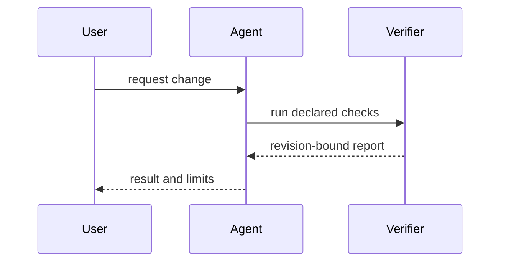

# Clean Show Me

Start with the visual. Add only the prose needed to read it.

## Evidence boundary

1. Label the view **Observed** or **Proposed**. Do not mix current and target state without a visible boundary.
2. When the view describes a repository, inspect the relevant source and include only the paths, symbols, calls, states, and dependencies the source supports.
3. Keep unknown, unavailable, and inferred behavior explicit. Never draw credentials, private data, or unrelated implementation detail.
4. A visual explains; it does not verify behavior, architecture completeness, or production state. Keep test, verification, review, and live-state evidence separate.

## Pick the smallest useful view

### Pseudocode

Use pseudocode for policy or an algorithm:

```text
on submit
  validate request
  if invalid
    return errors
  save change
  return result
```

### Call tree

Use a call tree for runtime control flow:

```text
applyChange
  loadPolicy
  runChecks
    collectResults
  writeReport
```

### Component tree

Use a component tree for UI ownership, state, and module boundaries:

```tsx
<VerificationPage> (apps/web/src/routes/verification.tsx)
  useVerificationRun()
  <RunToolbar>
    <RunButton /> (packages/ui)
  <ResultList />
```

### File tree

Use a shallow file tree for responsibility or refactor shape:

```text
src/
├── policy/       # decides what may run
├── runner/       # executes approved checks
└── evidence/     # writes normalized results
```

### Mermaid

Use Mermaid when interaction, order, or data movement matters:



### Diff

Use a diff when the point is the change from current to proposed shape:

```diff
 verify
   discover policy
+  validate policy source
   run checks
-  print success
+  write revision-bound report
```

### Complete block

Show the complete block when most of it is new, omitted context would hide ownership or order, or the user needs a copyable target:

```go
func SelectView(topic Topic) View {
	if topic.HasSequence {
		return MermaidSequence
	}
	return SmallestTextView
}
```

### Focused HTML artifact

For a visual UI, layout comparison, responsive state, or concept too dense for Mermaid, write one focused HTML artifact. Match the product's real tokens and labels, support desktop and mobile, and keep it accessible. Put generated explanation artifacts outside the repository unless the user asks to keep one as source. Open it with the host's preview capability when available; otherwise return the absolute path and mark preview `NOT_AVAILABLE`.

## Presentation rules

- Place each visual beside the short text it supports.
- Include only the context needed to answer the current question or compare the live options.
- Prefer one view. Combine views only when each resolves a different ambiguity.
- Match diff shape to the subject: components, files, calls, or state transitions.
- Preserve exact repository names and paths; do not invent a cleaner architecture than the inspected source.

## Provenance

Adapted from HumanLayer's MIT-licensed [`show-me`](https://github.com/humanlayer/skills/blob/main/plugins/show-me/skills/show-me/SKILL.md) skill for Clean Code's portable-agent and evidence boundaries.
